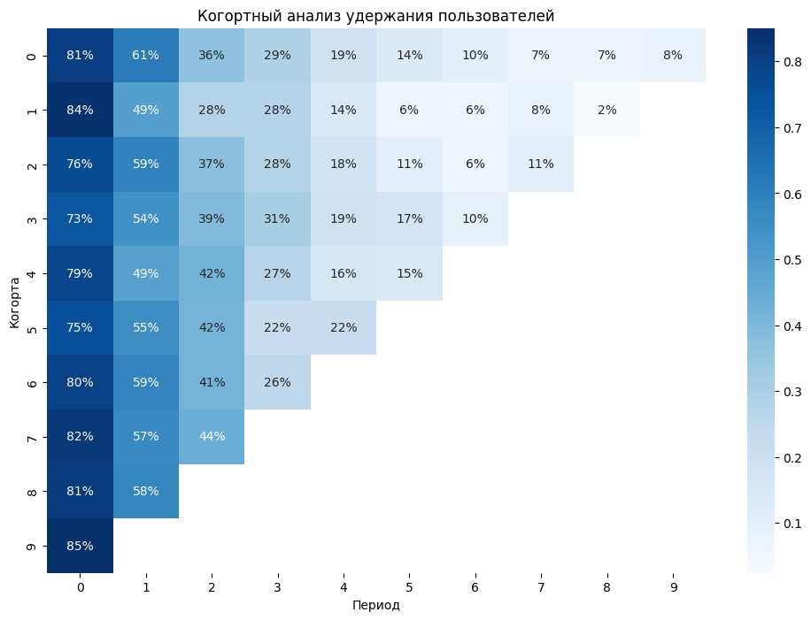

# Когортный анализ удержания и LTV

[](https://github.com/NikitaBoyarkin/tableau_cohort_analysis/actions/workflows/ci.yml)

Когортный анализ на синтетических данных: удержание пользователей, кривые
оттока и выручка/LTV по когортам прихода. Пайплайн на Python (pandas +
matplotlib/seaborn) плюс выгрузка, готовая к загрузке в **Tableau**.

> Данные синтетические — сгенерированы детерминированно (`seed=42`),
> воспроизводятся из кода. Бизнес-сценарий: monthly-активность нового
> пользователя с момента регистрации, по когортам прихода.

## Модель данных

Одна строка — один «пользователь × месяц наблюдения»:

| Поле          | Тип      | Описание                                              |
|---------------|----------|-------------------------------------------------------|
| `user_id`     | int      | идентификатор пользователя                            |
| `cohort_month`| date     | месяц прихода (ключ когорты, выводится из `join_date`)|
| `join_date`   | date     | дата регистрации (первое число месяца)               |
| `period`      | int      | месяцев с прихода (0 = месяц регистрации)             |
| `is_active`   | int 0/1  | активен ли пользователь в этом месяце                 |
| `revenue`     | int      | выручка за месяц (0, если не активен)                 |

`cohort_month` выводится из `join_date` (а не отдельным случайным полем),
как в реальном продакшене. Младшие когорты наблюдались меньше месяцев —
матрица удержания треугольная.

## Методология

- **Период 0 = 100 % удержания по определению.** Все активны в месяц прихода.
  Кривая убывает с периода 1: `retention(p) = 0.85 · 0.75^(p-1)`.
- **Выручка:** активный месяц → `Poisson(λ=10)`; неактивный → 0.
- **Размеры когорт:** число уникальных `user_id` в `period == 0`.
- **ARPU** = средняя выручка на user-месяц (неактивные месяцы входят нулём);
  **LTV** = суммарная выручка когорты / размер когорты.

## Метрики

| Метрика | Где | Что показывает |
|---|---|---|
| Размер когорты | `cohort_sizes()` | приток пользователей по месяцам |
| Матрица удержания | `retention_matrix()` | % активных, когорта × период |
| Кривые удержания | `retention_curves()` | blended-кривая: активные строки / все строки на период (взвешено размером когорт, **не** среднее по когортам) |
| Выручка, ARPU, LTV | `revenue_by_cohort()` | монетизация по когортам: `users, total_revenue, arpu_monthly, periods, ltv` |
| LTV с фиксированным горизонтом | `ltv_at_k(df, k=3)` | кумулятивная выручка на пользователя за периоды `0..k-1` — **сопоставимо между когортами** |

Три оговорки, без которых метрики читаются неверно:

- **`arpu_monthly`, а не `arpu`** — это средняя выручка на строку
  «пользователь × месяц», а не на пользователя: неактивные месяцы входят в
  среднее нулём. Колонка `periods` показывает наблюдённое число периодов на
  пользователя (сколько треугольного окна когорта реально покрывает).
- **`ltv` кумулятивен по наблюдённому окну когорты** (`arpu_monthly × periods`)
  и потому растёт с возрастом когорты — сравнивать его между когортами разного
  возраста нельзя. Для кросс-когортного сигнала используйте `ltv_at_k`.
- **`ltv_at_k(df, k=3)`** фиксирует горизонт: когорты, наблюдённые меньше `k`
  периодов, получают `NaN` (исключаются, а не заполняются нулём — частичное окно
  занизило бы LTV).

`print_summary()` печатает размеры когорт, матрицу удержания, blended-кривую,
таблицу `revenue_by_cohort` и `ltv_at_k(df, 3)`.



*Пример вывода: матрица удержания, когорта × период.*

## Реальные данные

Источник данных вынесен за `generate_data()`: любой CSV, приведённый к тому же
6-колоночному контракту, проходит через `real_data.load_real_data(path)`.

**Входной контракт** (те же колонки, что у синтетики): `user_id`, `join_date`,
`period`, `is_active`, `revenue`. `cohort_month` выводится из `join_date`.
Колонки вне контракта (PII: `email`, `phone`, `name`) отбрасываются — whitelist.

**Валидация строгая (fail-fast), ошибка называет путь к файлу и колонку.**
`load_real_data` поднимает `ValueError`, если:

- отсутствуют обязательные колонки;
- в `user_id`/`period`/`is_active`/`revenue` нечисловые значения;
- в этих колонках дробные значения (раньше `astype` молча обрезал: `1.9 → 1`);
- `join_date` не парсится как дата;
- `is_active` вне `{0, 1}`;
- `period` или `revenue` отрицательны;
- есть дубликаты `(user_id, period)`;
- у пользователя не ровно одна строка с `period == 0`.

**Смена источника — один аргумент.** Метрическая модель и схема выгрузки не
меняются: `build_export_frame()` принимает любой фрейм, удовлетворяющий
контракту, включая выход `load_real_data()`.

```python
from real_data import load_real_data
from tableau_export import build_export_frame, write_csv, write_hyper

df = load_real_data("cohort_data.csv")   # 6-колоночный контракт + валидация
export = build_export_frame(df=df)       # тот же export-фрейм, что у синтетики
write_csv(export)
write_hyper(export)
```

См. `real_data.py` и `tests/test_real_data.py` (16 тестов).

## Запуск

Требуется `uv` и Python ≥ 3.10.

```bash
uv sync --all-groups               # зависимости (+ dev: jupyter/ipykernel/nbformat/pytest)
uv run python cohort_analysis.py   # текстовый summary метрик
uv run jupyter notebook            # открыть tableau_cohort_analysis.ipynb
```

Проверка качества (34 теста: 12 `real_data` + 13 `cohort_analysis` + 9 `tableau_export`):

```bash
uv run pytest                      # 34 passed
uv run ruff check .                # чисто для всех .py
```

Те же шаги плюс smoke-прогон пайплайна выполняет CI
(`.github/workflows/ci.yml`) на каждый push в `main` и каждый PR.

Перегенерировать ноутбук с выводами:

```bash
uv run python -m ipykernel install --sys-prefix --name cohort-py   # один раз
uv run jupyter nbconvert --to notebook --execute --inplace \
    --ExecutePreprocessor.kernel_name=cohort-py tableau_cohort_analysis.ipynb
```

## Tableau

```bash
uv run python tableau_export.py
```

Создаёт в `tableau/`:

- `cohort_export.csv` — плоская таблица, идеальный shape для Tableau
  (доб. `cohort_label` и `period_date` — календарный месяц наблюдения);
- `cohort_extract.hyper` — Tableau Hyper-экстракт (через официальный
  Tableau Hyper API). Загружается через *Connect to Data → Tableau Extract*.

> Телеметрия Tableau при сборке `.hyper` **выключена** (`telemetry="false"`) —
> экстракт собирается локально, использование никуда не отправляется.

**Как построить когортный heatmap в Tableau:** Columns = `period`,
Rows = `cohort_label` (или `cohort_month`), Marks = Square,
Color = `AVG([is_active])`, Text = `AVG([is_active])` с форматом «Процент».
Нормировку «% of Total» по строке **использовать не нужно**: period 0 уже равен
1.0 по определению, поэтому повторная нормировка двойная и числа перестают
читаться как удержание. Если нужна кривая, индексированная к period 0
(retention = 100 % на старте), считайте `AVG([is_active]) / WINDOW_MAX(AVG([is_active]))`.
Либо `period_date` на Columns для календарной оси.

## Tableau Public: дашборд и публикация

Сборка 4-вью дашборда в Tableau Public Desktop и публикация по публичной ссылке.

**0. Подготовка данных**

```bash
uv run python tableau_export.py    # обновить tableau/cohort_extract.hyper
open tableau/cohort_extract.hyper  # открыть Tableau Public Desktop с данными
```

**1. Подключение данных**

- Tableau Public Desktop → *Connect to Data → Tableau Extract* → выбрать
  `tableau/cohort_extract.hyper`. Либо открыть `.hyper` двойным кликом.

**2. Четыре вью (листы)**

| Лист | Тип | Поля |
|---|---|---|
| Retention heatmap | Square | Columns = `period`, Rows = `cohort_label`, Color = AVG(`is_active`), Text = AVG(`is_active`) в формате «Процент» (для индексации к period 0: `AVG([is_active]) / WINDOW_MAX(AVG([is_active]))`) |
| Cohort sizes | Bar | Columns = `cohort_label`, Rows = COUNTD(`user_id`), Filter = `period` = 0 |
| Retention curves | Line | Columns = `period`, Rows = AVG(`is_active`), Color = `cohort_label` |
| LTV | Bar | Columns = `cohort_label`, Rows = SUM(`revenue`) / COUNTD(`user_id`) |

**3. Дашборд**

- New Dashboard → 4 листа тайлами (heatmap крупнее, остальные в ряд).
- Заголовок «Cohort Retention & LTV»; опционально фильтр по `cohort_label`.

**4. Публикация**

- *File → Save to Tableau Public* → вход в аккаунт (бесплатно) → Publish.
- Ссылка вида `https://public.tableau.com/views/<name>/...` — вставить в README.

## Структура проекта

```
tableau_cohort_analysis/
├── cohort_analysis.py            # генерация данных + функции метрик (+ CLI summary)
├── real_data.py                  # строгий загрузчик реального CSV по контракту
├── tableau_export.py             # Tableau-выгрузка: CSV + .hyper extract
├── tableau_cohort_analysis.ipynb # нарратив: генерация → метрики → viz → выводы
├── tests/                        # pytest: test_cohort_analysis / test_real_data / test_tableau_export
├── docs/
│   └── prd.md                    # PRD кейса
├── images/
│   └── retention-heatmap.png     # скриншот для README
├── .github/workflows/ci.yml      # CI: ruff + pytest + smoke-прогон пайплайна
├── pyproject.toml                # зависимости + ruff + pytest
├── uv.lock                       # зафиксированное окружение
├── .python-version
├── .gitignore
├── LICENSE                       # MIT (NikitaBoyarkin, 2026)
└── README.md
```

`cohort_data.csv` и `tableau/cohort_export.csv` — **генерируемые** артефакты:
они не хранятся в git (см. `.gitignore`) и воспроизводятся из кода
(`cohort_analysis.py` / `tableau_export.py`).

## Что было улучшено

| До | После |
|----|-------|
| README — только заголовок | полная документация: модель, методология, запуск, Tableau |
| Ноутбук — 1 гигант-ячейка без текста | 16 ячеек: markdown-нарратив + изолированные шаги |
| `cohort` — отдельное случайное поле, дублировало `join_date` | `cohort_month` выводится из `join_date` |
| Удержание в period 0 = 80 % (некорректно) | period 0 = 100 % по конвенции |
| Heatmap рендерил `nan%` в пустых ячейках | NaN замаскированы |
| Только retention-heatmap | + размеры когорт, кривые удержания, ARPU/LTV |
| Нет Tableau (несмотря на название) | CSV + Hyper-экстракт, инструкция по сборке view |
| Не воспроизводимо | `uv` + `pyproject.toml` + `.python-version` |

Второй проход (метрики, валидация, качество):

| До | После |
|----|-------|
| `arpu` — неоднозначно (на пользователя или на user-месяц?) | `arpu_monthly` (выручка на user-месяц) + новая колонка `periods` |
| LTV сравнивался между когортами разного возраста | `ltv_at_k(df, k=3)` — фиксированный горизонт, младшие когорты исключаются как `NaN` |
| `retention_curves()` — непрозрачное среднее | документированная blended-кривая (active rows / all rows), попала в `print_summary` |
| `cohort_sizes()` падал с непонятным `KeyError` без period 0 | явный `ValueError` |
| Реальный CSV принимался «как есть» | строгая валидация в `load_real_data()`: колонки, типы, целочисленность, даты, диапазоны, дубликаты, покрытие period 0 |
| Экспорт умел только синтетику | `build_export_frame(df=...)` принимает любой источник по 6-колоночному контракту |
| `period` — `int8`, `revenue` — `int32` (переполнение: 3e9 → отрицательное) | всё `int64`, Hyper-колонки `BIG_INT` |
| Телеметрия Tableau отправлялась при каждой сборке `.hyper` | `telemetry="false"` |
| 5 тестов | 34 теста (12 + 13 + 9) |
| Нет лицензии и CI | `LICENSE` (MIT) + `.github/workflows/ci.yml` |

## Ограничения

- Данные синтетические — паттерны удержания заданы формулой, не выведены
  из реального поведения.
- `ltv` младших когорт занижен из-за короткой истории наблюдения; для сравнения
  когорт используйте `ltv_at_k(df, k)` с общим `k` — он отбрасывает когорты,
  не набравшие горизонт, вместо того чтобы занижать их.
- `.hyper`-экстракт генерируется локально; для публикации на Tableau Server
  / Cloud нужен Tableau Server Client Library (`tableau-server-client`) —
  не входит в scope.

## Лицензия

MIT — см. `LICENSE` (© 2026 NikitaBoyarkin).
